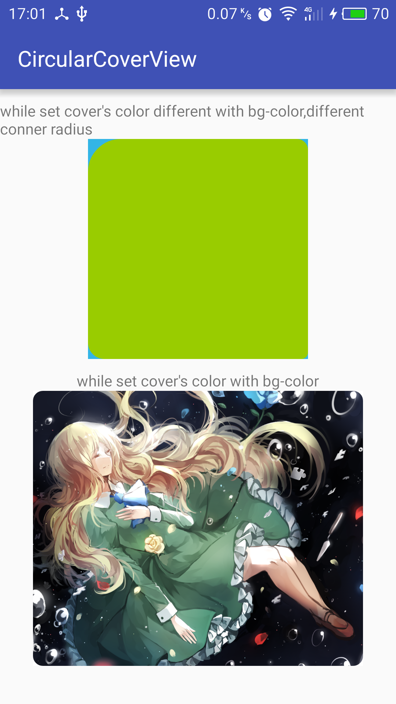

It's just a cover view of other views.You can set radians and color by self.



Useage
---

There are simply `CircularCoverView.class` and `attrs.xml` files in `library` directory in project.You can copy them in your project.

- In xml files:Use `RelativeLayout` or `FrameLayout` around your code.
```xml
<RelativeLayout
        android:layout_width="300dp"
        android:layout_height="250dp">

        <ImageView
            android:layout_width="match_parent"
            android:layout_height="match_parent"
            android:scaleType="centerCrop"
            android:src="@drawable/test1" />

        <com.zrp.library.CircularCoverView
            android:layout_width="match_parent"
            android:layout_height="match_parent"
            app:cover_color="@android:color/white"
            app:left_bottom_radius="9dp"
            app:left_top_radius="9dp"
            app:right_bottom_radius="9dp"
            app:right_top_radius="9dp" />
    </RelativeLayout>
```
- In code:Use `RelativeLayout` or `FrameLayout` as it's parent view and add view at last.
```java
RelativeLayout container = new RelativeLayout(this);
//create other child views...
CircularCoverView coverView = new CircularCoverView(this);
coverView.setLayoutParams(new RelativeLayout.LayoutParams(ViewGroup.LayoutParams.MATCH_PARENT, ViewGroup.LayoutParams.MATCH_PARENT));
coverView.setCoverColor(Color.WHITE);
coverView.setRadians(35, 35, 35, 35);
container.addView(coverView);
```
